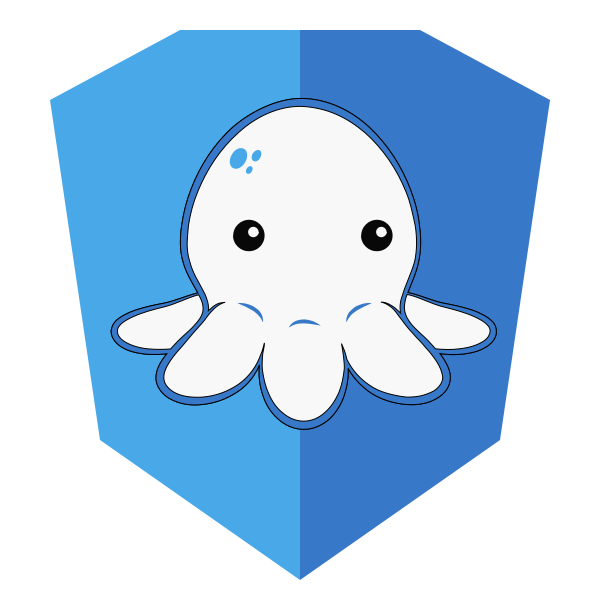

# Hi, I'm Jason H 👋

### (he/him)

I work at [Chainguard](https://chainguard.dev) on infrastructure to build and deliver [Chainguard Images](https://www.chainguard.dev/chainguard-images).

Before that I was at [ Red Hat](https://redhat.com), and before that [ Google Cloud](https://cloud.google.com), where I cofounded [ Google Cloud Build](https://cloud.google.com/cloud-build) and [ Tekton](https://tekton.dev).

I contribute to [`ko`](https://github.com/ko-build/ko) and [go-containerregistry](https://github.com/google/go-containerregistry), [Wolfi](https://wolfi.dev), [Apko](https://apko.dev), [Melange](https://github.com/chainguard-dev/melange), and a number of other things.

I build fun toys like https://kontain.me and https://gcping.com.

I sometimes make Chrome extensions to make my own life easier, like [this one](https://github.com/imjasonh/chrome-sound) and [this one](https://github.com/imjasonh/chrome-sigstore).
Maybe they'll make your life easier too, I have no idea.

## Talks

- [The Maintainer Monologues](https://www.youtube.com/watch?v=Qf1_5rU-Fts) at KubeCon NA 2024 w/ [Sarah Christoff](https://github.com/schristoff), [Scott Rigby](https://github.com/scottrigby), [Karen Chu](https://github.com/karenhchu) and [Ryan Nowak](https://github.com/rynowak)
- [Secure-by-Default Cloud Native Applications](https://www.youtube.com/watch?v=1yDN_kMjleM) at Cloud Native Rejekts NA Nov 2024 w/ [Jed Salazar](https://github.com/jedsalazar)
- [Building containers without Docker](https://changelog.com/shipit/91) on the _Ship It!_ podcast in Feb 2024
- [`ko`: The only good way to build Go containers](https://www.youtube.com/watch?v=goEjs22Ymk4) at GothamGo 2023
- [Securing the IaC Supply Chain](https://www.youtube.com/watch?v=ieiFsrgGRto) at KubeCon NA 2022 w/ [Jesse Sanford](https://github.com/jessesanford)
- [Registries After Dark, Part 2: Distributed Random Access Merkledags](https://www.youtube.com/watch?v=Xt_G-pUArTM) at KubeCon EU 2022 w/ [Dan Mangum](https://github.com/hasheddan)
- [Argo and Tekton: Pushing the Boundaries of the Possible on Kubernetes](https://www.youtube.com/watch?v=iPRw_n_JV4o) at KubeCon NA 2021 w/ [Alex Collins](https://github.com/alexec)
- [Russian Doll: Extending Containers with Nested Processes](https://www.youtube.com/watch?v=iz9_omZ0ctk) at KubeCon NA 2019 w/ [Christie Wilson](https://github.com/bobcatwilson)
- [Build and Deploy Go applications with `ko`](https://www.youtube.com/watch?v=o5eWy-2SDtc) on CloudNative FM
- [Introduction to Shipwright](https://www.youtube.com/watch?v=N5sVrygywZk) at cdCon 2021
- [Origin of Shipwright](https://www.youtube.com/watch?v=t3bSnaX4-aU) on CloudNative FM
- [What does the Continuous Delivery Foundation do?](https://www.youtube.com/watch?v=ytE-6p2jtSU) on [communitycentral.tv](https://communitycentral.tv) w/ Adam Kaplan, Andrea Frittoli, Vincent Demeester

## Blog Posts

- [Migrating Chainguard's Serving Infrastructure to Cloud Run](https://www.chainguard.dev/unchained/migrating-chainguards-serving-infrastructure-to-cloud-run)
- [Wolfi at work: Minimal developer workstations in the cloud](https://www.chainguard.dev/unchained/wolfi-at-work-minimal-developer-workstations-in-the-cloud)
- [The story of the most vulnerable Chainguard Image](https://www.chainguard.dev/unchained/the-story-of-the-most-vulnerable-chainguard-image)
- [Chainguard's Image Tagging Philosophy: Enabling High Velocity Updates, Part 1](https://www.chainguard.dev/unchained/chainguards-image-tagging-philosophy-enabling-high-velocity-updates-pt-1-of-3), [Part 2](https://www.chainguard.dev/unchained/chainguards-image-tagging-philosophy-enabling-high-velocity-updates-pt-2-of-3), [Part 3](https://www.chainguard.dev/unchained/chainguards-image-tagging-philosophy-enabling-high-velocity-updates-pt-3-of-3)
- [How Chainguard fixes vulnerabilities before they're detected](https://www.chainguard.dev/unchained/how-chainguard-fixes-vulnerabilities)
- [Building Chainguard's Container Image Registry](https://www.chainguard.dev/unchained/building-chainguards-container-image-registry)
- [Move Over, Dockerfiles! The New Way to Craft Containers
](https://www.chainguard.dev/unchained/move-over-dockerfiles-the-new-way-to-craft-containers)
- [GitHub Container Registry private repos sometimes… weren’t](https://www.chainguard.dev/unchained/ghcr-private-repos-sometimes-werent)
- [Building Wolfi from the ground up… and announcing arm64 support!
](https://www.chainguard.dev/unchained/building-wolfi-from-the-ground-up-and-announcing-arm64-support)
- [Chainguard enthusiastically supports donating `ko` to CNCF](https://www.chainguard.dev/unchained/chainguard-enthusiastically-supports-donating-ko-to-cncf)
- [Transparently Immutable Tags using Sigstore's Rekor](https://www.chainguard.dev/unchained/transparently-immutable-tags-using-rekor)
- [Shipwright: A framework for building container images on Kubernetes](https://developers.redhat.com/articles/2021/06/17/shipwright-framework-building-container-images-kubernetes)
