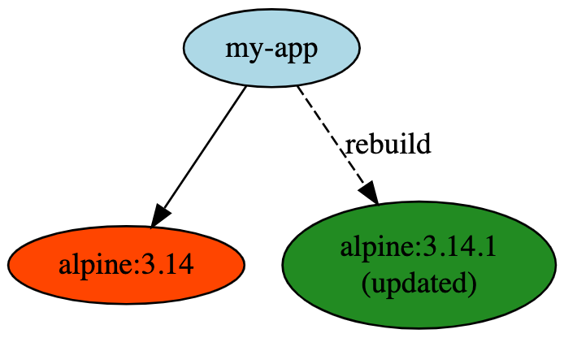
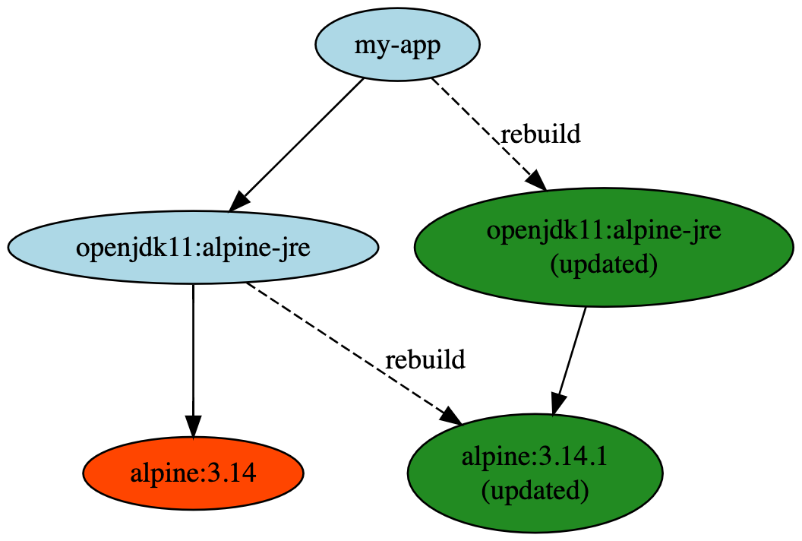

# OCI Base Image Annotations

https://articles.imjasonh.com/go-things-if-err.md 
Jason Hall 
_First published August 9, 2024_

---

When building and securing a container image, it's important to consider the security of your base image.
In a lot of cases, even if your code is perfectly secure (chances are it isn't), if you're based on an insecure base image, it doesn't matter much.

Base images provide a base operating system environment for your containers, whether they're built using [a Dockerfile's `FROM` directive](https://docs.docker.com/engine/reference/builder/#from), or Buildpacks, configured by the [run-image](https://buildpacks.io/docs/concepts/components/stack/).

The problem is, once your image is built, information about the base image is completely lost.
To the registry, and to any client that pulls your image, it's just a collection of layers, and there's no telling what image it came `FROM`, let alone whether what it came `FROM` has available fixes for any vulnerabilities it was rude enough to include for you.

### Base Image Annotations

To solve this, the Open Containers Initiative (OCI) recently [approved](https://github.com/opencontainers/image-spec/pull/822/) a pair of OCI standard annotations to describe this base image information.
Images can be given these annotations to point to their base images, to provide this important context.

The new standard annotations are:

- **`org.opencontainers.image.base.name`**: the mutable reference to the base image (e.g., `docker.io/alpine:3.14`)
- **`org.opencontainers.image.base.digest`**: the immutable digest of the base image at the time the image was built on it (e.g., `sha256:adab384...`)

How is this information useful?

### Verifying base image information

As a consumer of an image that carries this information, you can (and should!) first verify it.
To verify, simply combine the image reference and digest (`alpine:3.14@sha256:adab384...`), and look it up in the registry to get the base image's layers.
Those layers should match the lowest layers in the image that claims to be based on the base image.

### Detecting base image information

Once the base image is verified, there's even more you can do.

If the image happens to be signed by a tool like [`cosign`](https://github.com/sigstore/cosign), you can discover the base image's signature in the registry and verify it against the signature's public key.
This can give you further confidence about the provenance of the base image.

Perhaps more importantly, you can tell whether a new version of the image is available.
If someone has pushed a new image tagged as `alpine:3.14` (`3.14.1`, for example), you can find out by comparing the digest of `3.14` at the time your image was built (using the `base.digest` annotation), and the current digest from the registry.
If they match, there are no updates.
If they don't, you're out of date.

### Responding to base image updates

When you've detected that your base image has updates, you can rebuild, or even rebase your image to pick up those updates.

#### Rebuilding

If you remember where you built the image from, and still have source code available -- perhaps consulting the other OCI standard annotations for `image.source` and `image.version` -- then you can rebuild again from that revision.
A `FROM alpine:3.14` directive will pick up the new base image version, for example.

</img>

#### Rebasing

Even if you don't have the original source available, or don't want to rebuild from scratch, there's still an option to _rebase_ the image.

Rebasing is a relatively experimental option, which is not guaranteed to produce usable images in all cases.
_But_, if your image is carefully built so that your app layers make as few assumptions as possible about the layers below, then rebasing is an option.
[Buildpacks](https://buildpacks.io/docs/concepts/operations/rebase/) takes care to produce images that it expects to be safe for rebasing, for instance.
The way that [`ko`](https://github.com/google/ko/) builds images also makes them good candidates for rebasing.

During rebasing, layers above the original base image layers are snipped out, placed on top of the new base image layers, then pushed back to the registry.
The rebased image can be tagged over the original image, or given a new tag.

Rebasing is especially powerful when you have lots and lots of images that need to pick up the base image changes, since rebase operations can be accomplished with a handful of registry API calls, instead of fetching and building source from scratch.
A base image update can trigger thousands of rebases in a matter of seconds.

Whether rebuilding or rebasing, further automation can kick in to validate and roll out the new and improved image to production.

### Base image chains

Let's say your image is a Java image, based on something like [`adoptopenjdk/openjdk11:alpine-jre`](https://hub.docker.com/r/adoptopenjdk/openjdk11/) to provide the Java runtime environment.
That base image is itself [based on `alpine:3.14`](https://github.com/AdoptOpenJDK/openjdk-docker/blob/3473c4238a697add3c7ea5b894ad40a41d45c9d4/11/jre/alpine/Dockerfile.hotspot.releases.full#L20).

If the `alpine-jre` image were annotated to describe this relationship, it could be rebuilt when `alpine:3.14` changes.
Likewise, if your image pointed to `alpine-jre`, when that rebuilt image is validated and tagged, your image could detect it and update accordingly.
Taken to the extreme, a long chain of update signals could be sent along a chain of base images, validating the update along the way until, finally, it reaches your application sitting on top.

</img>

### When can I use it?

Well, now, but not very easily.

The annotation has just been added to the OCI spec, so not much tooling produces it in the wild today.

You can annotate images with `docker`'s experimental [`docker manifest annotate`](https://docs.docker.com/engine/reference/commandline/manifest_annotate/) command, or [`crane mutate --annotation`](https://github.com/google/go-containerregistry/blob/main/cmd/crane/doc/crane_mutate.md) to set this information, but build tools like Buildpacks and [`docker buildx`](https://docs.docker.com/buildx/working-with-buildx/) and [Kaniko](https://github.com/GoogleContainerTools/kaniko) could set these for you.

Support in other tools is progressing as well:
- [`ko`](https://github.com/google/ko) will set these annotations in the next release.
- [Buildah](https://github.com/containers/buildah) will set the annotations automatically starting with the next minor version v1.23.0.
- [`crane append`](https://github.com/google/go-containerregistry/blob/main/cmd/crane/doc/crane_append.md) will support a `--set-base-image-annotations` flag in its next release ([PR](https://github.com/google/go-containerregistry/pull/1098)).
- Feature request for [buildpacks](https://github.com/buildpacks/spec/issues/243)
- Feature request for [kaniko](https://github.com/GoogleContainerTools/kaniko/issues/1720)

On the other end, there isn't any tooling today that can understand and make use of the annotation.
Buildpacks' [`pack rebase`](https://buildpacks.io/docs/concepts/operations/rebase/) could use the annotation to rebase images annotated with base image information, whether they were originally built with Buildpacks or not.
There's a [PR in progress](https://github.com/google/go-containerregistry/pull/960) to teach [`crane rebase`](https://github.com/google/go-containerregistry/blob/main/cmd/crane/doc/crane_rebase.md) to use base image annotations as well.

With increased adoption on both ends, one could imagine an automated rebuild/rebase service that watches for base image updates and kicks off updates, even cascading updates, for any registered image.

## FAQ

### What if the base image isn't available anymore?

If the original base image by digest isn't available by the original digest anymore, then rebasing won't work -- rebasing logic won't be able to tell which layers belonged to the original base image and which belonged to the images layered above it.
This could be accounted for in further annotations, but in any case, rebuilding from source is still an option.

If the base image isn't available by its mutable reference either, then neither rebuilding nor rebasing will work, but it's still a useful signal to surface to developers that future builds will fail because of a missing base image.

### What about images used in [multi-stage Dockerfile builds](https://docs.docker.com/develop/develop-images/multistage-build/)?

The base image annotations are only intended to cover the image that provides the actual base image layers for the final image, and not any image used in the process of building, such as when using `FROM golang AS builder`.
One could imagine wanting to detect and trigger a rebuild when a new `golang` image is available, for example, but the existing base image annotations don't help with this.

There was quite a bit of discussion about annotating other relevant images in the [PR](https://github.com/opencontainers/image-spec/pull/822/) to specify the base image annotations, but it seemed like it would be easier to describe and make use of an annotation describing a single pointer to another image, rather than multiple pointers to multiple relevant images, resulting in a graph of possibly interesting other images.
If this use case sounds interesting to you, I definitely think it's worth pursuing, and there was interest in the OCI community to consider it.

---

If you have questions or comments, please [file an issue](https://github.com/imjasonh/imjasonh/issues/new?title=oci-base-image-annotations) or [suggest an edit in a pull request](https://github.com/imjasonh/ImJasonH/edit/main/articles/oci-base-image-annotations/README.md).

edit August 2, 2021:
- buildah issue to set the annotations: https://github.com/containers/buildah/issues/3415

edit Auguest 3, 2021:
- filed a roadmap feature request for `docker build`: https://github.com/docker/roadmap/issues/243

edit August 12, 2021:
- added FR links for buildpacks and kaniko
